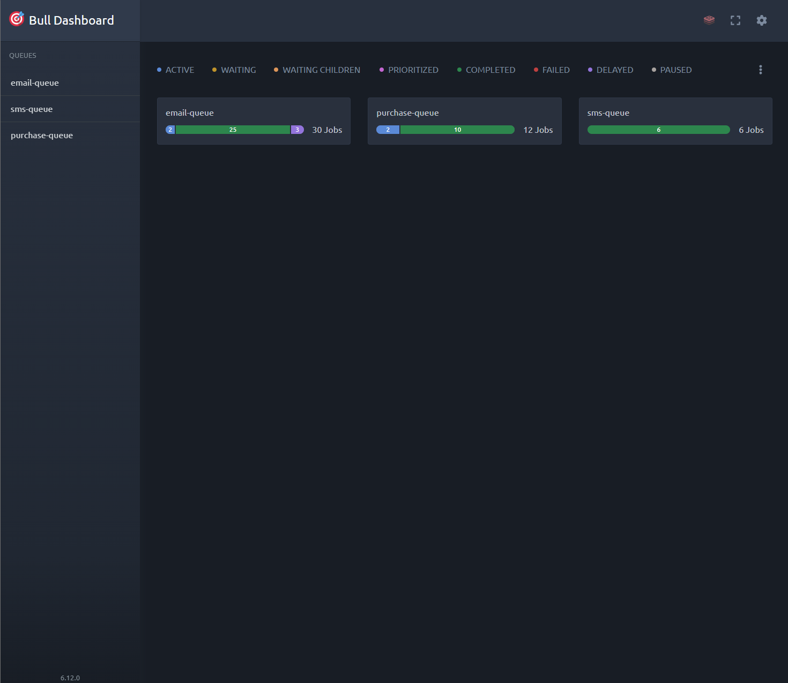
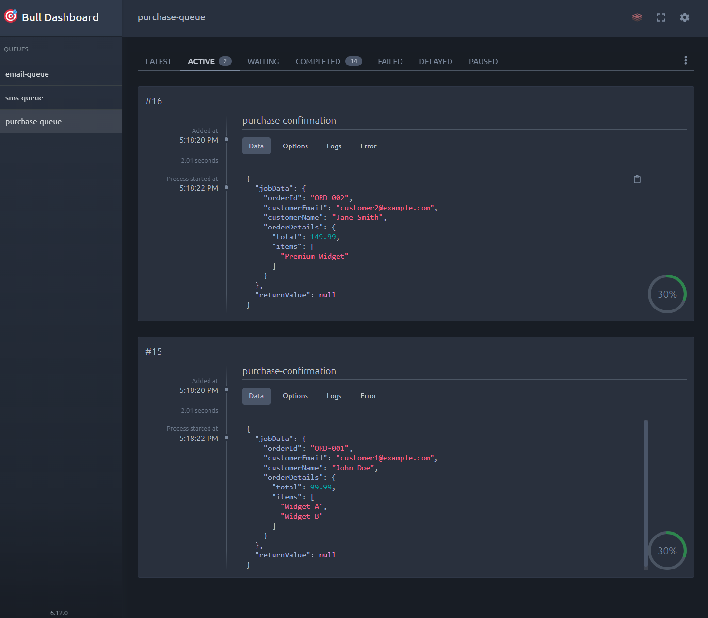

# 🚀 Redis Bull Queue Management System

A example job queue management system built with Node.js, Redis, and Bull. This project demonstrates how to implement multiple job queues with priority-based processing, comprehensive monitoring, and a web-based dashboard.

## 📸 Screenshots

### Bull Dashboard


### Bull Queue Processing


## ✨ Features

- **🎯 Multiple Queue Types**: Email, SMS, and Purchase processing queues
- **📊 Priority-Based Processing**: 5-tier priority system (Critical → Bulk)
- **🎛️ Web Dashboard**: Real-time monitoring with Bull Board
- **🔄 Automatic Retries**: Exponential backoff for failed jobs
- **📈 Progress Tracking**: Real-time job progress updates
- **🛡️ Error Handling**: Comprehensive error logging and recovery
- **⚡ Graceful Shutdown**: Clean process termination
- **🏗️ Modular Architecture**: Clean separation of concerns

## 🔧 Prerequisites

- **Node.js** v16+ 
- **Redis Server** v6+
- **npm** or **yarn**

## 📦 Installation

1. **Clone the repository**
   ```bash
   git clone <repository-url>
   cd reddis-bullmq
   ```

2. **Install dependencies**
   ```bash
   npm install
   ```

3. **Set up environment variables**
   ```bash
   cp .env.example .env
   # Edit .env with your Redis configuration
   ```

4. **Start Redis server**
   
   **Using Docker:**
   ```bash
   docker run -d -p 6379:6379 --name redis-server redis:alpine redis-server --requirepass 123456
   ```
   
   **Using local installation:**
   ```bash
   redis-server
   ```

## ⚙️ Configuration

Create a `.env` file in the root directory:

```env
REDIS_HOST=127.0.0.1
REDIS_PORT=6379
REDIS_PASSWORD=123456
PORT=4000
```

## 📁 Project Structure

```
reddis-bullmq/
├── 📁 queues/                 # Queue processors
│   ├── emailQueue.js          # Email processing (welcome, verification, newsletter)
│   ├── smsQueue.js           # SMS processing (login verification)
│   ├── purchaseQueue.js      # Purchase processing (confirmations)
│   └── index.js              # Queue exports
├── constants.js              # Shared configuration & constants
├── jobCreator.js            # Job creation logic
├── queueMonitoring.js       # Queue event monitoring
├── utils.js                 # Utility functions
├── index.js                 # Main application entry point
├── bullboard.js            # Bull Board dashboard server
└── .env                    # Environment configuration
```

## 🚀 Usage

### Start the Job Processor

```bash
npm start
# or
node index.js
```

This will:
- Initialize all queues
- Set up monitoring
- Create sample jobs
- Start processing jobs

### Start the Web Dashboard

```bash
node bullboard.js
```

Visit `http://localhost:4000/admin/queues` to view the dashboard.

## 📊 Queue Types

### 📧 Email Queue (`email-queue`)

Handles email-related jobs:

- **`welcome-email`**: Welcome emails for new users
- **`email-verification`**: Account verification emails  
- **`newsletter`**: Bulk newsletter campaigns

### 📱 SMS Queue (`sms-queue`)

Handles SMS communications:

- **`login-sms`**: Login verification codes

### 🛒 Purchase Queue (`purchase-queue`)

Handles e-commerce operations:

- **`purchase-confirmation`**: Order confirmation processing

## 🎯 Job Priority System

| Priority | Level | Use Case | Example |
|----------|-------|----------|---------|
| `1` | **CRITICAL** | Security, Login | SMS verification codes |
| `3` | **HIGH** | Account actions | Email verification |
| `5` | **MEDIUM** | Business transactions | Purchase confirmations |
| `7` | **LOW** | User onboarding | Welcome emails |
| `10` | **BULK** | Marketing | Newsletter campaigns |

## 📈 Monitoring & Dashboard

### Console Monitoring

Real-time console output with emojis:

```
🔄 Processing sms job 1 (login-sms)
✅ SMS job 1 (login-sms) completed successfully
📧 Queued welcome email for Alice Johnson (LOW priority)
```

### Web Dashboard

Access Bull Board at `http://localhost:4000/admin/queues` to:

- 📊 View job statistics
- 🔍 Monitor job progress
- 🐛 Debug failed jobs
- 📈 Analyze queue performance
- 🔄 Retry failed jobs

## 🔧 API Reference

### Adding Jobs Programmatically

```javascript
import { emailQueue, smsQueue, purchaseQueue } from './queues/index.js';
import { PRIORITY, JOB_TYPES } from './constants.js';

// Add an email verification job
await emailQueue.add(JOB_TYPES.EMAIL.VERIFICATION, {
    userEmail: 'user@example.com',
    userName: 'John Doe',
    verificationToken: 'abc123'
}, {
    priority: PRIORITY.HIGH,
    attempts: 4,
    backoff: 'exponential',
    delay: 1000
});

// Add a login SMS job
await smsQueue.add(JOB_TYPES.SMS.LOGIN, {
    phoneNumber: '+1-555-0123',
    verificationCode: '789012',
    userName: 'john_doe'
}, {
    priority: PRIORITY.CRITICAL,
    attempts: 5,
    backoff: 'exponential'
});
```

### Queue Events

```javascript
emailQueue.on('completed', (job, result) => {
    console.log(`Job ${job.id} completed:`, result);
});

emailQueue.on('failed', (job, error) => {
    console.error(`Job ${job.id} failed:`, error.message);
});

emailQueue.on('progress', (job, progress) => {
    console.log(`Job ${job.id} progress: ${progress}%`);
});
```

## 💡 Examples

### Custom Job Creation

```javascript
// Create a priority welcome email
await emailQueue.add(JOB_TYPES.EMAIL.WELCOME, {
    userEmail: 'newuser@example.com',
    userName: 'New User',
    templateData: {
        welcomeMessage: 'Welcome to our platform!',
        activationLink: 'https://app.example.com/activate?token=xyz789'
    }
}, {
    priority: PRIORITY.LOW,
    attempts: 3,
    delay: 2000,
    backoff: {
        type: 'exponential',
        delay: 2000
    }
});
```

### Bulk Newsletter

```javascript
await emailQueue.add(JOB_TYPES.EMAIL.NEWSLETTER, {
    subscribers: ['user1@example.com', 'user2@example.com'],
    subject: 'Monthly Newsletter',
    content: 'Your monthly update...'
}, {
    priority: PRIORITY.BULK,
    attempts: 2,
    delay: 10000 // 10 second delay
});
```

## 📝 Scripts

```bash
# Start the job processor
npm start

# Start Bull Board dashboard
npm run dashboard

# Run both (if you add these scripts to package.json)
npm run dev
```

## 📚 Resources

- [Bull Documentation](https://github.com/OptimalBits/bull)
- [Bull Board Documentation](https://github.com/felixmosh/bull-board)
- [Redis Documentation](https://redis.io/documentation)

